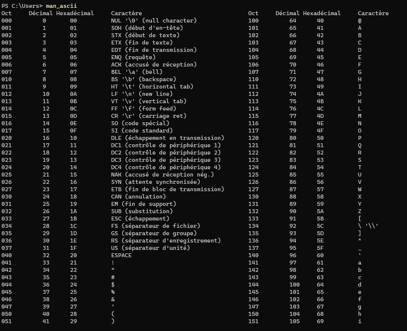

# Table-Ascii-en-C
<h1 align="center">Table ascii pour le terminal de Windows</h1>

    Etape 1:
    Copiez le dossier "table_ascii" et placez-le dans la racine

    Etape 2:
Pour vous assurer que l'application est bien accessible depuis n'importe quel répertoire, vous pouvez suivre les étapes suivantes :

Ouvrez une nouvelle fenêtre de terminal pour vous assurer que les modifications du PATH ont été prises en compte.

Tapez le nom de l'application suivi de l'extension .exe et appuyez sur Entrée.

Si l'application ne démarre pas et que vous obtenez un message d'erreur indiquant que l'application n'a pas été trouvée, cela signifie que le chemin d'accès de votre application n'a pas été correctement ajouté au PATH.

Pour corriger cela, vous pouvez ouvrir les variables d'environnement et vérifier que le chemin d'accès de votre application est bien présent dans la liste des chemins du PATH.

Ouvrez le menu Démarrer et cliquez avec le bouton droit de la souris sur "Ordinateur".
    
    1. Cliquez sur "Propriétés" dans le menu déroulant.
    
    2. Dans la fenêtre "Propriétés système", cliquez sur "Paramètres système avancés".
    
    3. Dans l'onglet "Avancé", cliquez sur le bouton "Variables d'environnement".
    
    4. Dans la section "Variables système", trouvez la variable nommée "Path" et cliquez sur "Modifier".
    
    5. Cliquez sur "Nouveau" et ajoutez le chemin d'accès de l'application que vous souhaitez ajouter. 
    ```console
        C:\table_ascii\
    ```
    
    6. Cliquez sur "OK" pour fermer toutes les fenêtres.
    
    7. Redémarrez l'application pour que les modifications prennent effet.

Notez que les étapes peuvent varier légèrement en fonction de la version de Windows que vous utilisez.

Une fois que votre application est correctement accessible depuis n'importe quel répertoire, vous pouvez simplement taper le nom de votre application suivi de l'extension .exe à partir de n'importe quel répertoire pour la lancer.
Exemple:

<div>
    
</div>

Si votre terminal reconnait l'encodage  'UTF8' vous pouvez remplacer le fichier "asciis_table.txt" dans le code source par "ascii_table.txt" comme suite:
 ```console
        fichier = fopen("C:/table_ascii/asciis_table.txt", "r");
    ```
     ```console
        fichier = fopen("C:/table_ascii/ascii_table.txt", "r");
    ```